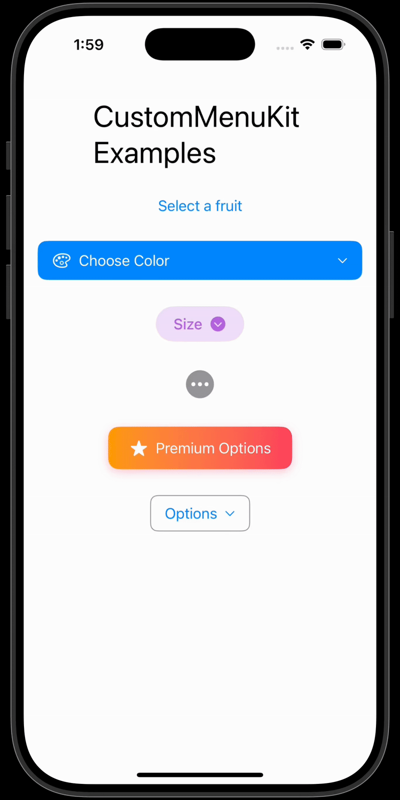

# CustomMenuKit

A customizable, drop-in replacement for SwiftUI's `Menu`, designed to provide an identical visual style to SwiftUI's Menu and behavior while offering enhanced features like searchable content.

| Searchable Menu | Custom Styles |
| --- | --- |
|  |  |

## Features

- **Visually Identical**: Looks and feels just like the native SwiftUI `Menu`.
- **Searchable Menus**: The `SelectionMenu` component includes a built-in search bar to filter long lists of options.
- **Highly Customizable**: Both the menu's label and its content can be customized with any SwiftUI `View`.
- **Single-Selection Support**: Built-in support for menus that manage a single selection from a list of options, complete with checkmarks.
- **Auto-Dismiss**: Menu items automatically dismiss the menu after their action is performed.

## Installation

You can add `CustomMenuKit` to your Xcode project as a package dependency.

1. In Xcode, open your project and navigate to **File > Add Packages...**
2. In the search bar, enter the URL for this repository: `https://github.com/tcollins590/CustomMenuKit.git`
3. Click **Add Package**.
4. Select the `CustomMenuKit` library and add it to your app's target.

## Usage

First, import the library into your SwiftUI file:

```swift
import CustomMenuKit
```

### Standard Menu

Use `CustomMenu` as a direct replacement for `Menu`. You can provide a custom view for the label.

```swift
@State private var selectedSize: String? = nil
let sizes = ["Small", "Medium", "Large"]

CustomMenu {
    // This is the label for the menu button
    HStack {
        Text(selectedSize ?? "Size")
        Image(systemName: "chevron.down.circle.fill")
    }
    .padding()
    .background(Color.purple.opacity(0.2))
    .clipShape(Capsule())
} content: {
    // This is the content of the menu
    ForEach(sizes, id: \.self) { size in
        MenuButton(action: {
            selectedSize = size
        }) {
            Text(size)
        }
    }
}
```

### Selection Menu

Use `SelectionMenu` for cases where you need the user to select a single option from a list. It automatically manages the selection state and displays a checkmark next to the selected item.

```swift
@State private var selectedFruit: String? = nil
let fruits = ["Apple", "Banana", "Orange", "Grape", "Strawberry", ...]

SelectionMenu(
    selection: $selectedFruit,
    options: fruits,
    label: { $0 ?? "Select a fruit" }
)
```

### Searchable Selection Menu

To make a `SelectionMenu` searchable, simply add the `searchable: true` parameter. A search bar will be added to the top of the menu, allowing users to filter the options.

```swift
SelectionMenu(
    selection: $selectedFruit,
    options: fruits,
    label: { $0 ?? "Select a fruit" },
    searchable: true
)
```

### Customizing the Label

The label for both `CustomMenu` and `SelectionMenu` can be any SwiftUI `View`.

```swift
SelectionMenu(
    selection: $selectedColor,
    options: colors,
    label: { selection in
        HStack {
            Image(systemName: "paintpalette")
            Text(selection ?? "Choose Color")
            Spacer()
            Image(systemName: "chevron.down")
        }
        .padding()
        .background(Color.blue)
        .foregroundColor(.white)
        .cornerRadius(10)
    },
    searchable: true
)
```

## Example Application

This repository includes a demo application inside the `CustomMenuKitDemo` folder. To run it, open the `CustomMenuKitDemo.xcodeproj` file and run the `CustomMenuKitDemo` scheme. 